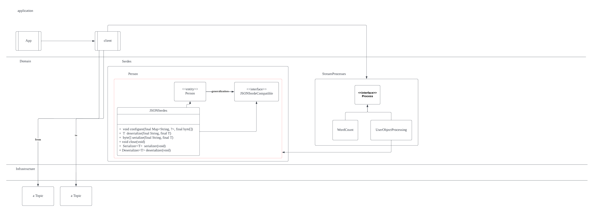

* [Design](#design)
* [Quick Start](#quick-start-with-word-count)

## Design



## Quick start with word count

See [StreamProcesses](src/main/java/app/StreamProcesses.java) for sample stream processing

### Startup kafka

Follow instruction in official doc.

https://kafka.apache.org/quickstart

### Create topic

```markdown
bin/kafka-topics.sh --create --topic src-topic --bootstrap-server localhost:9092
bin/kafka-topics.sh --create --topic sink-topic --bootstrap-server localhost:9092
```

### Start producer

```markdown
bin/kafka-console-producer.sh --bootstrap-server localhost:9092 --topic src-topic
```

### Start consumer

```markdown
bin/kafka-console-consumer.sh --bootstrap-server localhost:9092 --topic sink-topic --value-deserializer "org.apache.kafka.common.serialization.LongDeserializer"
```

### Run app
From the root

```markdown
./gradlew stream:run
```
